# CI/CD Pipeline Flow

```mermaid
graph LR
    subgraph "Development"
        DEV[Developer]
        GIT[Git Repository<br/>GitHub]
    end

    subgraph "CI - GitHub Actions"
        TRIGGER[Workflow Trigger<br/>on push to main]
        BUILD[Build Docker Image]
        TEST[Run Tests<br/>lint, unit tests]
        TAG[Tag Image<br/>latest + commit SHA]
    end

    subgraph "Container Registry"
        HARBOR[Harbor Registry<br/>hub.lab.local]
        SCAN[Image Scanning<br/>Trivy]
    end

    subgraph "CD - GitOps"
        ARGOCD[ArgoCD<br/>Continuous Sync]
        MANIFEST[K8s Manifests<br/>GitOps Repo]
    end

    subgraph "Kubernetes Cluster"
        DEPLOY[Rolling Deployment]
        HEALTH[Health Checks]
        ROLLBACK[Automatic Rollback<br/>if unhealthy]
    end

    subgraph "Observability"
        METRICS[Prometheus Metrics]
        LOGS[Loki Logs]
        ALERTS[Alertmanager]
    end

    %% Flow
    DEV -->|git push| GIT
    GIT -->|webhook| TRIGGER
    TRIGGER --> BUILD
    BUILD --> TEST
    TEST -->|pass| TAG
    TAG -->|docker push| HARBOR
    HARBOR --> SCAN
    SCAN -->|notify| ARGOCD
    ARGOCD -->|sync| MANIFEST
    MANIFEST --> DEPLOY
    DEPLOY --> HEALTH
    HEALTH -->|healthy| METRICS
    HEALTH -->|unhealthy| ROLLBACK
    ROLLBACK --> ALERTS
    DEPLOY --> LOGS

    %% Styling
    classDef dev fill:#e3f2fd,stroke:#1565c0,stroke-width:2px
    classDef ci fill:#f3e5f5,stroke:#6a1b9a,stroke-width:2px
    classDef registry fill:#fff3e0,stroke:#e65100,stroke-width:2px
    classDef cd fill:#e8f5e9,stroke:#2e7d32,stroke-width:2px
    classDef k8s fill:#fce4ec,stroke:#c2185b,stroke-width:2px
    classDef observability fill:#e0f2f1,stroke:#00695c,stroke-width:2px

    class DEV,GIT dev
    class TRIGGER,BUILD,TEST,TAG ci
    class HARBOR,SCAN registry
    class ARGOCD,MANIFEST cd
    class DEPLOY,HEALTH,ROLLBACK k8s
    class METRICS,LOGS,ALERTS observability
```



## Pipeline Details

### 1. Development Phase

**Developer Workflow:**
```bash
# Make changes locally
git checkout -b feature/new-feature
# ... make changes ...
git commit -m "Add new feature"
git push origin feature/new-feature

# Create pull request
# After review and approval
git merge to main
```

**Triggers:**
- Push to `main` branch
- Pull request to `main` (runs tests only)
- Manual workflow dispatch

---

### 2. Continuous Integration (GitHub Actions)

**Build Workflow:**
```yaml
name: Build and Push
on:
  push:
    branches: [main]

jobs:
  build:
    runs-on: ubuntu-latest
    steps:
      - Checkout code
      - Run linters (flake8, black)
      - Run unit tests (pytest)
      - Build Docker image
      - Tag with commit SHA and 'latest'
      - Push to Harbor registry
```

**Image Tagging Strategy:**
- `latest` - Most recent successful build
- `{commit-sha}` - Specific commit identifier
- `v{version}` - Release versions (future)

**Test Coverage:**
- Python linting (flake8)
- Code formatting (black)
- Unit tests (pytest)
- Security scanning (planned)

---

### 3. Container Registry (Harbor)

**Harbor Features Used:**
- Private Docker registry
- Image vulnerability scanning (Trivy)
- Image retention policies
- Webhook notifications to ArgoCD
- RBAC for image access

**Registry Structure:**
```
harbor.lab.local/
├── football/
│   ├── web:latest
│   ├── web:{commit-sha}
│   ├── scheduler:latest
│   └── scheduler:{commit-sha}
└── infrastructure/
    └── (future microservices)
```

---

### 4. Continuous Deployment (ArgoCD)

**GitOps Workflow:**
```
1. ArgoCD watches GitOps repository
2. Detects changes to Kubernetes manifests
3. Compares desired state vs actual state
4. Syncs differences automatically (or manually)
5. Monitors health of deployed resources
```

**Sync Policies:**
- Automated sync enabled for production
- Self-healing enabled (auto-corrects drift)
- Prune enabled (removes deleted resources)

**Health Checks:**
- Readiness probes
- Liveness probes
- Startup probes for slow-starting apps

---

### 5. Deployment to Kubernetes

**Rolling Update Strategy:**
```yaml
strategy:
  type: RollingUpdate
  rollingUpdate:
    maxSurge: 1        # 1 extra pod during update
    maxUnavailable: 0  # Zero downtime
```

**Deployment Steps:**
1. Pull new image from Harbor
2. Create new pod with updated image
3. Wait for health checks to pass
4. Route traffic to new pod
5. Terminate old pod
6. Repeat for remaining pods

**Automatic Rollback:**
- If new pods fail health checks
- If crash loop detected
- If ready state not achieved within timeout
- ArgoCD reverts to previous working version

---

### 6. Observability & Monitoring

**Metrics Collection:**
```
Application → /metrics endpoint → Prometheus scrape
                                ↓
                            Grafana dashboards
                                ↓
                            Alert rules
                                ↓
                            Alertmanager → Email
```

**Log Aggregation:**
```
Application → stdout/stderr → Promtail → Loki → Grafana
```

**Key Metrics Tracked:**
- HTTP request rate
- Error rate (5xx responses)
- Response time (p50, p95, p99)
- Pod restart count
- Resource utilization (CPU, memory)
- Custom: `football_current_nfl_week`

---

## Pipeline Performance

**Build Time:** ~3-5 minutes
- Checkout: 10s
- Tests: 30-60s
- Build: 2-3 minutes
- Push: 30-60s

**Deployment Time:** ~2-3 minutes
- ArgoCD sync detection: 30s
- Pull image: 30s
- Rolling update: 1-2 minutes

**Total Time (Code to Production):** ~5-8 minutes

---

## Security Measures

### Build Time
- ✅ Code linting and formatting checks
- ✅ Unit test execution
- ⏳ Dependency vulnerability scanning (planned)
- ⏳ SAST scanning (planned)

### Registry
- ✅ Image vulnerability scanning (Trivy)
- ✅ Private registry (Harbor)
- ✅ RBAC for image access
- ✅ Image retention policies

### Runtime
- ✅ Non-root containers
- ✅ Read-only root filesystem (where possible)
- ✅ Resource limits enforced
- ✅ Network policies (planned)
- ✅ Secret injection via Vault

---

## Failure Scenarios & Recovery

### Scenario 1: Build Fails
**Detection:** GitHub Actions workflow fails  
**Action:** Developer notified via GitHub, fix code and push  
**Impact:** No production impact (bad build never deployed)

### Scenario 2: Tests Fail
**Detection:** pytest returns non-zero exit code  
**Action:** Workflow stops, no image built  
**Impact:** No production impact

### Scenario 3: Deployment Unhealthy
**Detection:** Kubernetes readiness probes fail  
**Action:** ArgoCD automatic rollback to previous version  
**Impact:** Brief performance degradation, no user-facing downtime

### Scenario 4: Registry Unavailable
**Detection:** Cannot pull image during deployment  
**Action:** Deployment fails, pods continue running old version  
**Impact:** Cannot deploy updates until registry restored

---

## Future Improvements

### Short Term
- [ ] Add integration tests to CI pipeline
- [ ] Implement canary deployments (10% → 50% → 100%)
- [ ] Add deployment notifications (Slack/email)
- [ ] Automated rollback testing

### Medium Term
- [ ] Blue-green deployment option
- [ ] Automated performance testing
- [ ] Database migration automation
- [ ] Feature flag system

### Long Term
- [ ] Multi-environment (dev/staging/prod)
- [ ] Automated smoke tests post-deployment
- [ ] Progressive delivery with metrics analysis
- [ ] Chaos engineering tests
