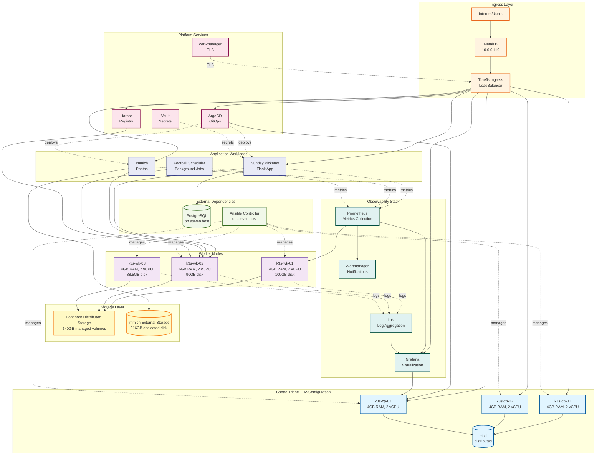

# Kubernetes Cluster Architecture



## Architecture Highlights

### High Availability Design

**Control Plane:**
- 3 control plane nodes with embedded etcd
- Distributed consensus via etcd cluster
- MetalLB provides stable VIP for API access
- Any control plane node can handle requests

**Storage:**
- Longhorn distributed block storage across all 6 nodes
- Data replication for fault tolerance
- Automatic volume failover

**Application:**
- Multiple replicas for critical services
- Pod distribution across worker nodes
- Rolling updates for zero-downtime deployments

### Resource Distribution

**Control Plane (12 GB total):**
- Kubernetes API Server
- etcd distributed database
- Controller managers
- Scheduler
- ArgoCD application controller

**Workers (14 GB total):**
- Application workloads
- Storage backend (Longhorn)
- Observability agents
- Ingress controllers

**k3s-wk-02 (6 GB):**
- Harbor registry (heavy workload)
- Immich server (photo processing)
- Football web application
- Receives extra RAM allocation

### Data Flow Patterns

1. **User Request Flow:**
   ```
   User → Internet → MetalLB (10.0.0.119) → Traefik → Service Pod
   ```

2. **Deployment Flow:**
   ```
   Git Push → GitHub Actions → Harbor Registry → ArgoCD → K8s Deployment
   ```

3. **Observability Flow:**
   ```
   Pods → Metrics Endpoint → Prometheus → Grafana
   Pods → Logs → Promtail → Loki → Grafana
   Prometheus → Alert Rules → Alertmanager → Email
   ```

4. **Secret Injection:**
   ```
   Vault → Agent Injector → Pod Environment Variables
   ```

### Network Isolation

- **Pod Network:** 10.42.0.0/16 (CNI managed)
- **Service Network:** 10.43.0.0/16 (ClusterIP)
- **Node Network:** 10.0.0.0/24 (physical)
- **External Access:** Via MetalLB VIP only

### Storage Tiers

**Tier 1 - Critical Data:**
- Prometheus metrics (10 GB SSD-backed Longhorn)
- Vault secrets (5 GB encrypted Longhorn)
- Harbor registry (5 GB Longhorn)

**Tier 2 - Application Data:**
- Immich photos (500 GB dedicated external disk)
- Database (60 GB on separate VM)

**Tier 3 - Cache/Temporary:**
- Redis caches (2-5 GB Longhorn)
- Temporary pod storage (ephemeral)
