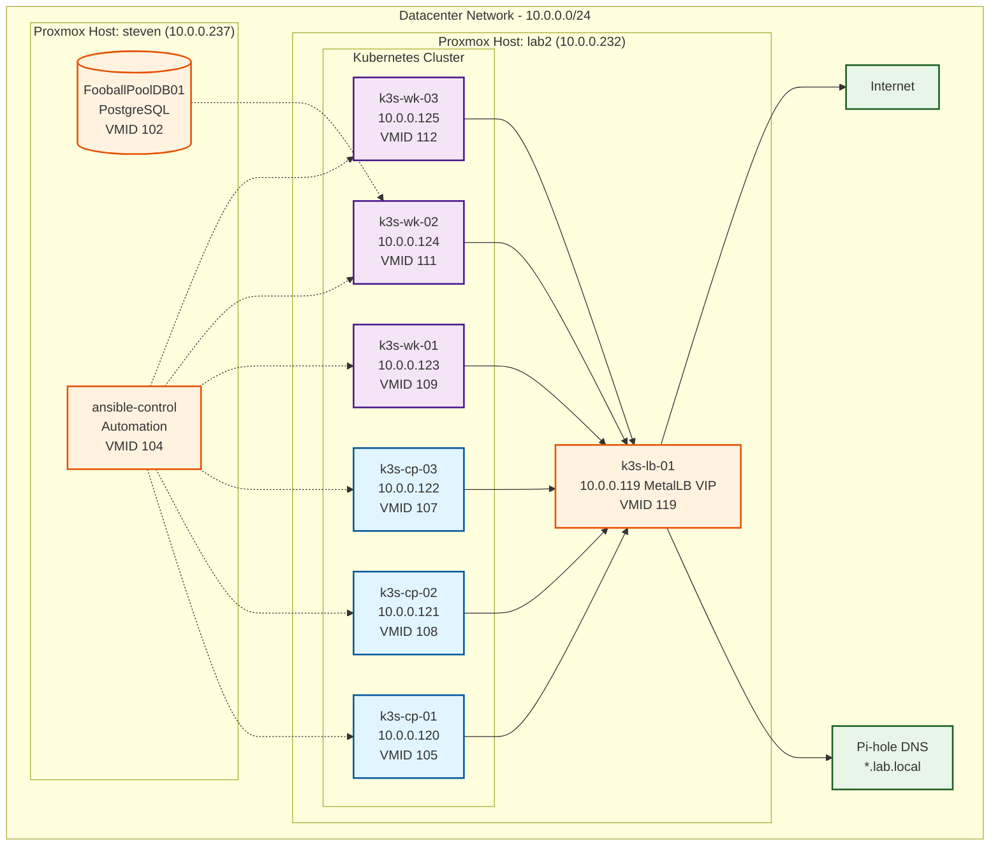

# Network Topology Diagram

## Network Details

**Network Subnet:** 10.0.0.0/24  
**Gateway:** 10.0.0.1 (assumed)  
**DNS:** Pi-hole (resolves *.lab.local domains)

### IP Allocation

| Range | Purpose |
|-------|---------|
| 10.0.0.120-122 | Control Plane Nodes |
| 10.0.0.123-125 | Worker Nodes |
| 10.0.0.119 | MetalLB LoadBalancer VIP (Traefik) |
| 10.0.0.232 | Proxmox Host "lab2" |
| 10.0.0.237 | Proxmox Host "steven" |

### Service Domains (via MetalLB VIP 10.0.0.119)

All services accessible through Traefik ingress at 10.0.0.119:

- `argocd.lab.local` → ArgoCD GitOps
- `grafana.lab.local` → Grafana Dashboards
- `prometheus.lab.local` → Prometheus Metrics
- `alertmanager.lab.local` → Alert Manager
- `longhorn.lab.local` → Longhorn Storage UI
- `vault.lab.local` → HashiCorp Vault
- `hub.lab.local` → Harbor Registry
- `football.lab.local` → Sunday Pickems App
- `immich.lab.local` → Immich Photos

### Pod Network (Internal)

**CIDR:** 10.42.0.0/16 (k3s default)

| Node | Pod Network |
|------|-------------|
| k3s-cp-01 | 10.42.0.x |
| k3s-cp-02 | 10.42.2.x |
| k3s-cp-03 | 10.42.1.x |
| k3s-wk-01 | 10.42.5.x |
| k3s-wk-02 | 10.42.3.x |
| k3s-wk-03 | 10.42.4.x |

### Service Network (Internal)

**CIDR:** 10.43.0.0/16 (k3s default ClusterIP range)

### Network Flow

1. **External Access:** Internet → MetalLB VIP (10.0.0.119) → Traefik → Services
2. **Internal DNS:** Pi-hole resolves *.lab.local → 10.0.0.119
3. **Database Connection:** k8s pods → 10.0.0.x (FooballPoolDB01 on steven)
4. **Automation:** ansible-control → SSH → all k3s nodes
