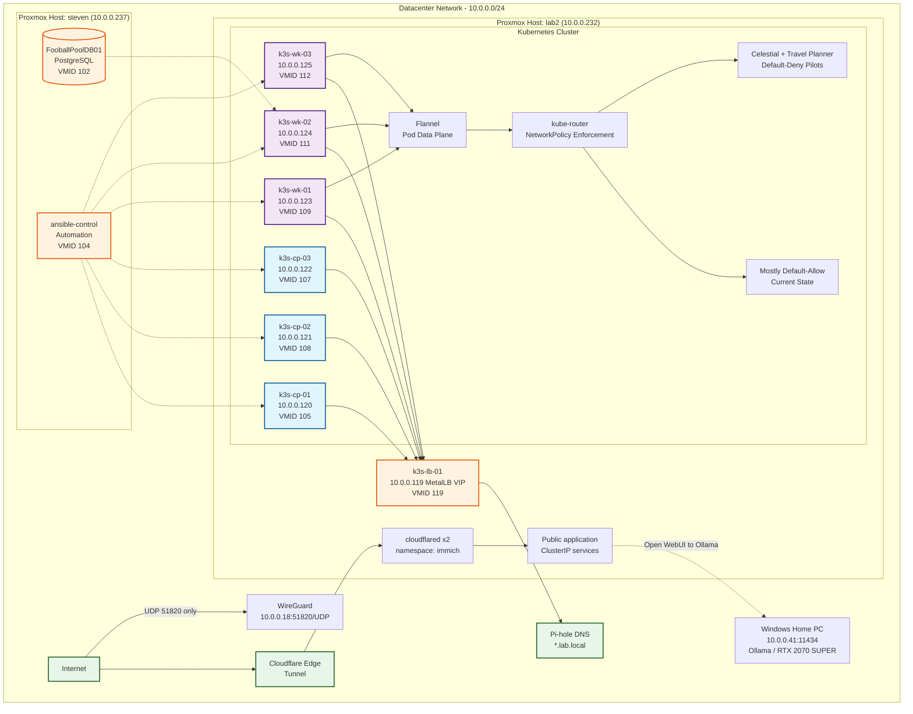

# Network Topology Diagram


```mermaid
graph TB
    subgraph "Datacenter Network - 10.0.0.0/24"
        subgraph "Proxmox Host: lab2 (10.0.0.232)"
            subgraph "Kubernetes Cluster"
                CP1[k3s-cp-01<br/>10.0.0.120<br/>VMID 105]
                CP2[k3s-cp-02<br/>10.0.0.121<br/>VMID 108]
                CP3[k3s-cp-03<br/>10.0.0.122<br/>VMID 107]
                WK1[k3s-wk-01<br/>10.0.0.123<br/>VMID 109]
                WK2[k3s-wk-02<br/>10.0.0.124<br/>VMID 111]
                WK3[k3s-wk-03<br/>10.0.0.125<br/>VMID 112]
                FLANNEL[Flannel<br/>Pod Data Plane]
                KUBEROUTER[kube-router<br/>NetworkPolicy Enforcement]
                DEFAULTALLOW[Mostly Default-Allow<br/>Current State]
                SEGMENTEDPILOTS[Celestial + Travel Planner<br/>Default-Deny Pilots]
            end
            LB[k3s-lb-01<br/>10.0.0.119 MetalLB VIP<br/>VMID 119]
            CLOUDFLARED[cloudflared x2<br/>namespace: immich]
            CLUSTERIP[Public application<br/>ClusterIP services]
        end

        subgraph "Proxmox Host: steven (10.0.0.237)"
            DB[(FooballPoolDB01<br/>PostgreSQL<br/>VMID 102)]
            ANSIBLE[ansible-control<br/>Automation<br/>VMID 104]
        end

        PIHOLE[Pi-hole DNS<br/>*.lab.local]
        WG[WireGuard<br/>10.0.0.18:51820/UDP]
        OLLAMA[Windows Home PC<br/>10.0.0.41:11434<br/>Ollama / RTX 2070 SUPER]
        CF[Cloudflare Edge<br/>Tunnel]
        INTERNET[Internet]
    end

    %% Connections
    CP1 & CP2 & CP3 --> LB
    WK1 & WK2 & WK3 --> LB
    WK1 & WK2 & WK3 --> FLANNEL
    FLANNEL --> KUBEROUTER
    KUBEROUTER --> DEFAULTALLOW
    KUBEROUTER --> SEGMENTEDPILOTS
    LB --> PIHOLE
    INTERNET --> CF
    CF --> CLOUDFLARED
    CLOUDFLARED --> CLUSTERIP
    INTERNET -->|UDP 51820 only| WG
    CLUSTERIP -. Open WebUI to Ollama .-> OLLAMA
    DB -.-> WK2
    ANSIBLE -.-> CP1
    ANSIBLE -.-> CP2
    ANSIBLE -.-> CP3
    ANSIBLE -.-> WK1
    ANSIBLE -.-> WK2
    ANSIBLE -.-> WK3

    %% Styling
    classDef controlPlane fill:#e1f5ff,stroke:#01579b,stroke-width:2px
    classDef worker fill:#f3e5f5,stroke:#4a148c,stroke-width:2px
    classDef infrastructure fill:#fff3e0,stroke:#e65100,stroke-width:2px
    classDef external fill:#e8f5e9,stroke:#1b5e20,stroke-width:2px

    class CP1,CP2,CP3 controlPlane
    class WK1,WK2,WK3 worker
    class LB,DB,ANSIBLE infrastructure
    class PIHOLE,INTERNET,CF external
```

## Network Details

**Network Subnet:** 10.0.0.0/24  
**Gateway:** 10.0.0.1 (assumed)  
**DNS:** Pi-hole (resolves *.lab.local domains)

### IP Allocation

| Range | Purpose |
|-------|---------|
| 10.0.0.120-122 | Control Plane Nodes |
| 10.0.0.123-125 | Worker Nodes |
| 10.0.0.119 | MetalLB LoadBalancer VIP (Traefik) |
| 10.0.0.232 | Proxmox Host "lab2" |
| 10.0.0.237 | Proxmox Host "steven" |

### Service Domains (via MetalLB VIP 10.0.0.119)

All services accessible through Traefik ingress at 10.0.0.119:

- `argocd.lab.local` → ArgoCD GitOps
- `grafana.lab.local` → Grafana Dashboards
- `prometheus.lab.local` → Prometheus Metrics
- `alertmanager.lab.local` → Alert Manager
- `longhorn.lab.local` → Longhorn Storage UI
- `vault.lab.local` → HashiCorp Vault
- `hub.lab.local` → Harbor Registry
- `football.lab.local` → Sunday Pickems App
- `immich.lab.local` → Immich Photos

### Pod Network (Internal)

**CIDR:** 10.42.0.0/16 (k3s default)

| Node | Pod CIDR |
|------|----------|
| k3s-cp-01 | `10.42.0.0/24` |
| k3s-cp-03 | `10.42.1.0/24` |
| k3s-cp-02 | `10.42.2.0/24` |
| k3s-wk-02 | `10.42.3.0/24` |
| k3s-wk-03 | `10.42.4.0/24` |
| k3s-wk-01 | `10.42.5.0/24` |

### Current Segmentation State

```text
Flannel data plane -> kube-router NetworkPolicy enforcement -> mostly default-allow namespaces
```

NetworkPolicy enforcement is active. Celestial and Travel Planner are successful workload-specific default-deny pilots with explicit dependency allowlists. Most namespaces still have no NetworkPolicy and remain default-allow, so cluster-wide rollout remains in progress.

Required flows that must be accounted for in future segmentation include Cloudflare Tunnel access across namespaces, Prometheus scraping, CoreDNS, Open WebUI to `10.0.0.41:11434`, and Kubernetes workloads to PostgreSQL at `10.0.0.129`.

### Service Network (Internal)

**CIDR:** 10.43.0.0/16 (k3s default ClusterIP range)

### Network Flow

1. **Verified public web access:** Internet → Cloudflare → Cloudflare Tunnel → Kubernetes ClusterIP service → application pod
2. **Verified VPN access:** Internet → Xfinity UDP 51820 forwarding → WireGuard at 10.0.0.18
3. **Internal ingress:** Pi-hole resolves `*.lab.local` → Traefik at 10.0.0.119 → services
4. **Hermes model traffic:** Open WebUI in Kubernetes → Ollama on Windows home PC at 10.0.0.41:11434
5. **Database connection:** k8s pods → 10.0.0.x (FooballPoolDB01)
6. **Automation:** ansible-control → SSH → all k3s nodes

There are no verified manual TCP 80/443 port forwards. The Traefik LoadBalancer address is a LAN ingress path, not the verified public HTTP/HTTPS edge.
