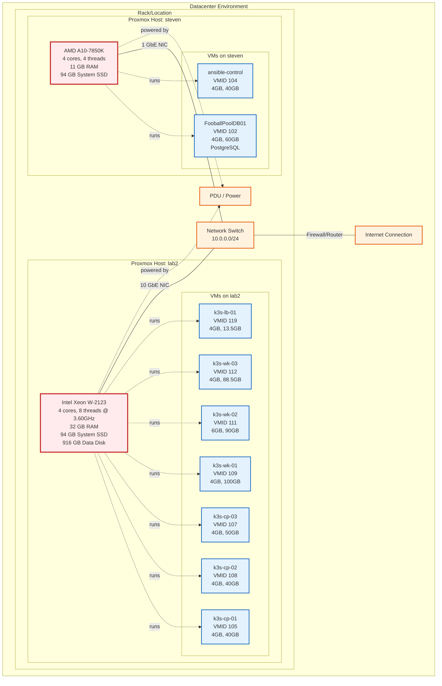

# Physical Infrastructure Layout



## Physical Resource Summary

### Datacenter Resources

**Total Physical Hosts:** 2  
**Total CPU Cores:** 8 physical (12 logical threads)  
**Total RAM:** 43 GB  
**Total Storage:** ~1.1 TB  
**Network:** 10.0.0.0/24 private network

---

## Host Specifications

### Primary Host: "lab2"

**Hardware:**
- **Model:** Workstation-class server
- **CPU:** Intel Xeon W-2123
  - Architecture: x86_64
  - Cores: 4
  - Threads: 8 (Hyper-Threading enabled)
  - Base Clock: 3.60 GHz
  - Cache: L1: 256 KB, L2: 4 MB, L3: 8.25 MB (shared)
- **RAM:** 32 GB DDR4
- **Storage:**
  - Disk 1: 94 GB SSD (Proxmox system)
  - Disk 2: 916 GB (dedicated for Immich photos)
- **Network:** 
  - Interface: enp0s31f6
  - Speed: 1 Gbps (capable of 10 Gbps)
- **IP Address:** 10.0.0.232

**Resource Utilization:**
- RAM Usage: 27 GB / 32 GB (84% - mostly k8s VMs)
- CPU Usage: ~95% average
- Storage: 5% used on system disk

**VMs Hosted:** 8 total (7 running, 1 stopped)
- All 6 Kubernetes cluster nodes
- 1 Load balancer
- 1 Template VM (stopped)

**Role:** Primary production Kubernetes infrastructure

---

### Secondary Host: "steven"

**Hardware:**
- **Model:** Desktop/Workstation (repurposed)
- **CPU:** AMD A10-7850K Radeon R7
  - Architecture: x86_64
  - Cores: 4
  - Threads: 4 (no SMT)
  - Base Clock: 3.7 GHz
  - APU: 12 compute cores (4 CPU + 8 GPU)
- **RAM:** 11 GB DDR3
- **Storage:**
  - Disk 1: 94 GB SSD (Proxmox system)
- **Network:**
  - Interface: enp2s0
  - Speed: 1 Gbps
- **IP Address:** 10.0.0.237

**Resource Utilization:**
- RAM Usage: 7.9 GB / 11 GB (72%)
- CPU Usage: ~99% average
- Storage: 26% used on system disk
- Swap: 2.2 GB / 8 GB in use

**VMs Hosted:** 8 total (2 running, 6 stopped)
- 1 Production database
- 1 Ansible automation controller
- 6 Stopped VMs (templates, old VMs)

**Role:** Support services (database, automation)

---

## Network Infrastructure

### Physical Network

```
Internet
   ↓
Firewall/Router
   ↓
Network Switch (10.0.0.0/24)
   ├── lab2 (10.0.0.232)
   ├── steven (10.0.0.237)
   ├── Pi-hole DNS
   └── Other devices
```

**Network Configuration:**
- **Subnet:** 10.0.0.0/24 (254 usable IPs)
- **Gateway:** 10.0.0.1 (assumed)
- **DNS:** Pi-hole (internal) + upstream resolvers
- **DHCP:** Static IPs for servers, dynamic for other devices

### Virtual Networking

**Proxmox Bridges:**
- `vmbr0` on both hosts
- Bridged to physical NICs
- All VMs connected to vmbr0
- Full layer-2 connectivity between hosts

**Kubernetes Networking:**
- **Node Network:** 10.0.0.0/24 (physical)
- **Pod Network:** 10.42.0.0/16 (CNI overlay)
- **Service Network:** 10.43.0.0/16 (ClusterIP)
- **Ingress VIP:** 10.0.0.119 (MetalLB)

---

## Power & Cooling

**Power Distribution:**
- PDU or datacenter power (assumed)
- UPS backup (assumed in datacenter)
- Estimated power consumption:
  - lab2: ~150-200W under load
  - steven: ~100-150W under load

**Cooling:**
- Datacenter HVAC
- Individual CPU coolers on each host
- No custom cooling required

---

## Storage Architecture

### lab2 Storage

```
Physical Disks:
├── /dev/sda (94 GB SSD)
│   ├── /dev/sda1 - BIOS boot
│   ├── /dev/sda2 - EFI (1 GB)
│   └── /dev/sda3 - LVM
│       ├── pve-root (Proxmox system)
│       └── pve-data (VM images)
└── /dev/sdb (916 GB)
    └── /dev/sdb1 - /mnt/immich-storage
```

**Storage Allocation:**
- Proxmox System: ~4 GB used / 94 GB
- VM Images: ~420 GB allocated
- Immich Storage: 2 MB used / 916 GB available

### steven Storage

```
Physical Disks:
└── /dev/sda (94 GB SSD)
    ├── /dev/sda1 - BIOS boot
    ├── /dev/sda2 - EFI (1 GB)
    └── /dev/sda3 - LVM
        ├── pve-root (Proxmox system)
        └── pve-data (VM images)
```

**Storage Allocation:**
- Proxmox System: ~23 GB used / 94 GB (26%)
- VM Images: ~100 GB allocated

---

## Virtualization Layer

### Proxmox VE Configuration

**Version:** 9.0 (both hosts)
- Kernel: 6.14.x
- KVM/QEMU virtualization
- LVM storage backend
- Cloud-init template support

**Features Used:**
- VM snapshots
- Live migration (between compatible nodes)
- Resource monitoring
- Backup capabilities
- Web UI management

### VM Provisioning

**Automation:**
- Terraform creates VMs from cloud-init templates
- Ansible configures OS and installs software
- Standardized VM templates (Ubuntu 24.04, Rocky 9)

**Template VMs:**
- ubuntu-24.04-cloudinit (VMID 9000, 9100)
- rocky-9-cloudinit (VMID 9001)

---

## Disaster Recovery Considerations

### Single Points of Failure

**Identified:**
1. ✅ All k8s nodes on single physical host (lab2)
2. ✅ No host-level redundancy
3. ✅ Single network switch (assumed)
4. ⚠️ Database on separate host (actually good!)

**Mitigations:**
- Kubernetes provides application-level HA
- Velero backups to external storage
- Can manually migrate VMs if needed
- Database isolated from k8s cluster failures

### Backup Strategy

**VM-Level:**
- Proxmox backup capabilities
- External backup target (planned)

**Application-Level:**
- Velero for Kubernetes resources
- Longhorn snapshots for volumes
- Database dumps for PostgreSQL

---

## Scalability Path

### Vertical Scaling (Per Host)

**lab2 Upgrade Options:**
- RAM: 32 GB → 64 GB or 128 GB
- CPU: Already enterprise-grade
- Storage: Add more data disks

**steven Upgrade Options:**
- RAM: 11 GB → 16 GB or 32 GB
- CPU: Limited by socket
- Storage: Add more disks

### Horizontal Scaling

**Add More Hosts:**
- Purchase additional Proxmox host
- Migrate some k8s nodes for true HA
- Set up Proxmox cluster
- Implement Ceph distributed storage

**Add More VMs:**
- Current hosts can support 2-3 more VMs each
- lab2 has RAM headroom (5 GB free)
- steven is more constrained (2.7 GB free)

---

## Cost Considerations

**Datacenter Hosting:**
- Power costs
- Cooling costs
- Network bandwidth
- Physical space rental
- Remote hands if needed

**Benefits of Current Setup:**
- Repurposed hardware (lower capital cost)
- Right-sized for workload
- Room for growth
- Professional environment
